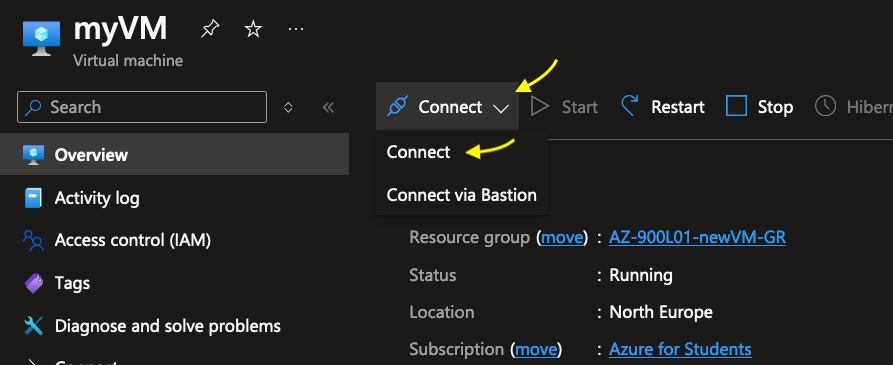

# Labs-Azure-Create-a-VM-machine

On this lab I will create a VM machine and run a web server that will be accessible via a public ip assigned by Azure.
I have split this lab in 3 parts:

1) Creation of VM machine
2) Connection to VM machine via RDP
3) Install the web server and access it

**1 - Creation of the VM machine:**

I've created a VM machine in the AZURE portal by entering to https://portal.azure.com/ and using my Microsoft credential to access.


Also activated the TFA for more security.


Once inside Microsoft Azure, I selected the Virtual Machine icon. On the next page selected **Create >> Azure virtual machine**.


Once the new configuration windows opens, I started filling out the following fields.
I did it like follows:

- Subscription: Azure for Students
- Resource group: AZ-900L01-newVM-GR
- Virtual machine name: myVM
- Region: North EU
- Availability options: No Infrastructure redundancy required
- Image: Windows Server 2019 Datacenter - x64 Gen3
- Size: Standard D2s v3
- Username: azureuser
- Password: "create something easy to remember as it's for testing purpose only"
- Select inbound ports: HTTP(80), RDP(3389)

Now selected **Next: Disks >**


Once in the new page, I selected the option **Networking** and checked again for the **Public inbound ports**, just in case something changed (it should be still HTTP(80) & RDP(3389)).


Then selected **Next: Management >**

On this new page, I selected **Monitoring** and looked for the option **Boot diagnostics**, I selected **Disable** option.


Let the other fields as they are per default and clicked on the button (in blue color) **Review + create**.

After the validation, I could see how much the VM will cost in **currency / hr**.
Clicked on **Create** to proceed.


**2 - Connect to VM via RDP:**

On this part I will connect to the vm machine using RDP. 
Once deployment succeeded, I clicked on **Go to resource**.


On the next page, clicked on dropdown list **Connect** and selected **Connect** again.



On this page, I kept everything as it is per default in order to connect with the public address over RDP (3389).
Clicked on **Download RDP File** and opened the downloaded file.

**Note**: In case you are using a MAC like I do, please download the **Windows App** by following the steps explained in this link: https://learn.microsoft.com/en-us/windows-server/remote/remote-desktop-services/clients/remote-desktop-mac<br>
Once you have downloaded the app, you will see that the icon of the downloaded RDP file has changed to something like:


I double clicked on it to open the RDP session. It opened a prompt asking for  credentials of the VM.


Also asked for accepting the certificate for the connection.


Once done, I could start enjoying my VM.


**3 - Install Web-Server and access it via Public IP:**

Once inside the VM machine, I opened **Powershell** with admin rights in order to install the Web-Server.


The command used in Powershell:
```powershell
Install-WindowsFeature -name Web-Server -IncludeManagementTools
```


I could see the instalation process starting.


I was sure all was successfully installed once I saw the following prompt:


To check the Web-Server, I just went back to the overview page in Azure and opened a new browser page using the Public IP assigned to my machine.


By entering the IP in the URL I could see my Web-Server running. :)


Now in order to avoid the machine running after this testing, I just clicked on **Stop**. 


And as a last step I made sure to delete the machine.


Just made a **refresh** to be sure the machine was deleted.


